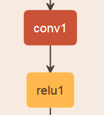
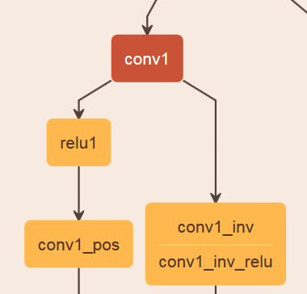

# Exploring the predictive power of the inverse of ReLU cutouts

## Summary

ReLU's layers are ofter used for training deep networks. They offer a non-linearity that keeps the gradients under control and thus allowing big network to be trained.

Their usefulness comes from zeroing out parts of the output and creating the sparseness necessary for the network to work.

A lot of the network's layer's output is lost using ReLU's so in this post I'll explore the possibility of using the predictive power of all the ReLU's discarded data.

## Methodology

We'll begin with some stock trivial models. 

We will replace every ReLU with a junction first inverting the output by multiplying with -1 and then ReLU it, 
keeping both the negative and the positive parts in different parts of the layer but both being positive

We will then run the models and check if it increases the accuracy. We will test several permutation, using shared weights or different weights along the junctions.

All trials will be tested on mnist dataset using the caffe framework

## Trials

We've performed trials with
* Sharing weights between fully connected layer and conv2
* Sharing weights between fully connected layer and different conv2
* Different fully connected layer and different conv2

TODO Nets here

## Results

Throughout the trials final accuracy did not increase significally, improvements of < 0.01% are within the margin of error.

TODO training graphs here

## Conclusion

We conclude the zero'd out parts do not provide greater accuracy and computing the reverse doubles the computation needed in every junction. In conclusion **we reject the hypothesis that inverting and computing the remainders could provide additional accuracy**.
